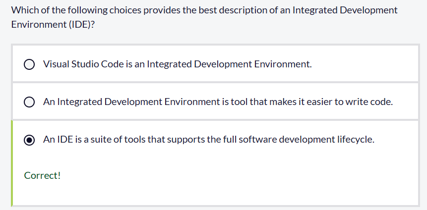

# Install the .NET SDK - Exercise

**`5 minutes`**

The C# Dev Kit extension for Visual Studio Code helps you to install the .NET Software Development Kit (SDK). The .NET SDK is required to run and debug C# applications.

In this exercise, you install the .NET SDK on your computer.

### Check to see if .NET is already installed

Use the following steps to complete this section of the exercise:

1. Ensure that you have Visual Studio Code open.

2. On the Terminal menu, select **New Terminal**.

     A command prompt, such as `C:\Users\AccountName>`, should be displayed.

3. At the command prompt, type: `dotnet --version` and then press the Enter key.

     This command displays the version number if .NET is installed on your PC.

4. Take a moment to view the response to your `dotnet --version` command.

     If you receive an error message telling you that the term `dotnet` isn't recognized, the .NET SDK isn't installed.

     If a version of .NET is installed, you should see a response message listing the version number similar to the following:

     `8.0.100`

5. Close the Terminal panel.

### Install the .NET 8 SDK

Having the latest supported version of the .NET platform installed is recommended. Although .NET 6 and 7 are also supported, .NET 8 includes improvements that you may find helpful.

Visual Studio Code and the C# Dev Kit help you to install the .NET SDK.

❗**Note**

The C# training series that's available on Microsoft Learn uses .NET 8. Ensure that you have .NET 8 installed if you plan on completing this training.

Use the following steps to complete this section of the exercise:

1. On the View menu, select **Command Palette**.

2. At the Command Palette prompt, type **.NET: Install** and then select **.NET: Install New .NET SDK**.

3. Under **Latest**, ensure that **.NET 8** is selected, and then select **Install**.

4. Wait for the .NET SDK to download and install.

     The installation process may take a few minutes to complete.

5. When the installation is complete, close Visual Studio Code.

### Verify your installation

Visual Studio Code searches for the .NET SDK when it opens. If the .NET SDK is installed, Visual Studio Code should detect it.

Use the following steps to complete this section of the exercise:

1. Open Visual Studio Code.

2. Close the Welcome page, and then open a Terminal panel.

     To open a Terminal panel, on the Terminal menu, select **New Terminal**.

3. At the Terminal command prompt, type: `dotnet --version` and then press the Enter key.

     You need to open a new command prompt window after installing the .NET SDK to ensure that it's detected.

4. Verify that a .NET 8 version number is listed.

     The version number displayed should be similar to: `8.0.300`

     You may see a more recent version number, that's okay. The version number will begin with `8`. if you installed the .NET 8 SDK.

5. Close the Terminal panel.

Congratulations on getting .NET installed. You're now ready to start writing, running, and debugging C# applications using Visual Studio Code.

