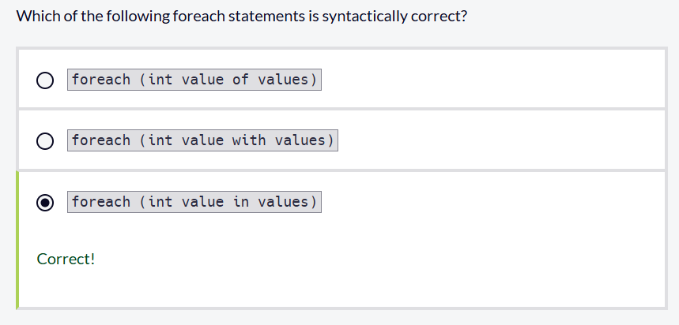

# Summary

**`2 minutes`**

Your goal in this module was to work with a sequence of Order IDs programmatically to identify potentially fraudulent orders. You created an array of Order IDs, then iterated through each element of the sequence looking for a common fraud trait.

Arrays enabled you to store each Order ID as an element of a single variable. You addressed a specific element of the array using an index -- a zero-based numeric value. You were able to retrieve and set the value of each element. You iterated through the elements of the array to inspect or output each element's value.

Imagine how difficult it would be to handle related data in your code if you ***didn't*** have a structure like an array? You would need to know ahead of time just how many data elements you expected to work with and define a separate variable for each value. That would create a brittle solution.

Arrays can be sized when created according to the amount of data you need to work with. As you become even more familiar with arrays (and similar data structures), you'll often use them in your applications to process and manage data.

#### FreeCodeCamp Question

