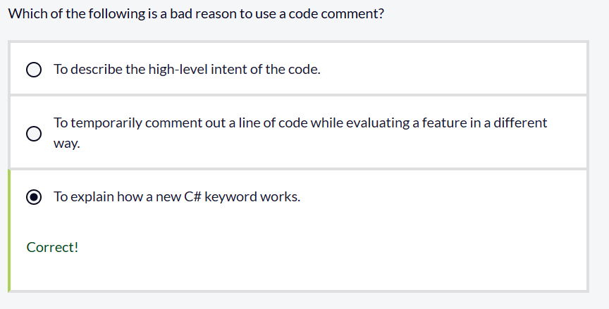

# Summary

**`2 minutes`**

Your goal was to write code that's easy to read and understand.

You used variable naming conventions to improve the readability of your code. Camel case helps you identify a local variable as opposed to other identifiers in your code. It also gives you a way to use multiple words that describe the purpose of a given variable to the reader. You used code comments to temporarily remove code that you wanted to rewrite before deleting. You also used code comments to add more meaningful explanations of the code's higher-level purpose in the system. Finally, you saw how the compiler doesn't care about whitespace in the code, so you used ***whitespace judiciously to help improve the readability of your code***.

You learned that you write the code once, but read the code many times. Improving readability helps you and other developers maintain and support your code long term.

### Extra Reading

- [**`C# identifier naming rules and conventions`**](https://learn.microsoft.com/en-us/dotnet/csharp/fundamentals/coding-style/identifier-names)

### Freecodecamp Answer:

