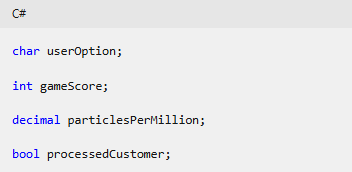

# Declare Variables

**`6 minutes`**

A literal is *literally* a hard-coded value. Hard-coded values are values that are constant and unchanged throughout the execution of the program. However, most applications will require you to work with values that you don't know much about ahead of time. In other words, you'll need to work with data that comes from users, from files, or from across the network.

When you need to work with data that isn't hard-coded, you'll declare a variable.

### What is a variable?

A **variable** is a container for storing a type of value. Variables are important because their values can change, or vary, throughout the execution of a program. Variables can be assigned, read, and changed. You use variables to store values that you intend to use in your code.

A **variable** name is a human-friendly label that the compiler assigns to a memory address. When you want to store or change a value in that memory address, or whenever you want to retrieve the stored value, you just use the variable name you created.

### Declare a variable

To create a new variable, you must first declare the data type of the variable, and then give it a name.

```
string firstName;
```

In this case, you're creating a new variable of type `string` called `firstName`. From now on, this variable can only hold string values.

You can choose any name as long as it adheres to a few C# syntax rules for naming variables.

### Variable name rules and conventions

A software developer once famously said "The hardest part of software development is naming things." Not only does the name of a **variable** have to follow certain syntax rules, it should also be used to make the code more human-readable and understandable. That's a lot to ask of one line of code!

Here's a few important considerations about variable names:

- Variable names can contain alphanumeric characters and the underscore character. Special characters like the hash symbol # (also known as the number symbol or pound symbol) or dollar symbol `$` are not allowed.

- Variable names must begin with an alphabetical letter or an underscore, not a number.

- Variable names are case-sensitive, meaning that `string Value;` and `string value;` are two different variables.

- Variable names must not be a C# keyword. For example, you cannot use the following variable declarations: `decimal decimal;` or `string string;`.

There are coding conventions that help keep variables readable and easy to identify. As you develop larger applications, these coding conventions can help you keep track of variables among other text.

Here are some coding conventions for variables:

- Variable names should use **camel case**, which is a style of writing that uses a lower-case letter at the beginning of the first word and an upper-case letter at the beginning of each subsequent word. For example, `string thisIsCamelCase;`.

- Variable names should begin with an alphabetical letter. Developers use the underscore for a special purpose, so try to not use that for now.

- Variable names should be descriptive and meaningful in your app. Choose a name for your variable that represents the kind of data it will hold.

- Variable names should be one or more entire words appended together. Don't use contractions or abbreviations because the name of the variable (and therefore, its purpose) may be unclear to others who are reading your code.

- Variable names shouldn't include the data type of the variable. You might see some advice to use a style like `string strValue;`. That advice is no longer current.

The example `string firstName;` follows all of these rules and conventions, assuming you want to use this variable to store data that represents someone's first name.

### Variable name examples

Here's a few examples of variable declarations using the data types you learned about thus far:

```
char userOption;

int gameScore;

decimal particlesPerMillion;

bool processedCustomer;
```



### Recap

Here's what you've learned so far about variables:

- Variables are temporary values you store in the computer's memory.
- Before you can use a variable, you have to declare it.
- To declare a variable, you first select a data type for the kind of data you want to store, and then give the variable a name that follows the rules.


Now that you know how to declare a variable, let's learn how to set, retrieve, and initialize the value of a variable.

