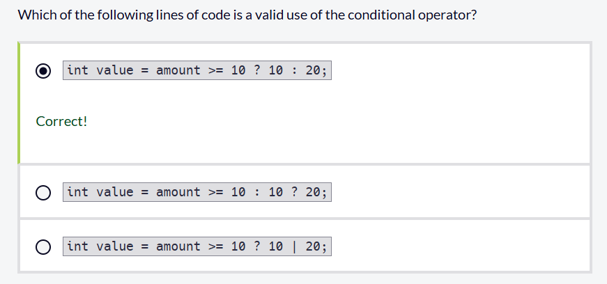

# Summary

**`2 minutes`**

Your goal was to develop decision statements for various situations by using Boolean expressions and C# operators.

Using various operators and techniques, you wrote code that evaluated equality, compared values to see if one was greater or less than (or equal to) the other. You compared strings, massaging them to create a more accurate comparison that eliminated issues like casing and spaces that might interfere with the result you were hoping for. You learned how to use logical negation to flip a value for comparison, and used the result of methods in your Boolean expressions. Finally, you used the conditional operator to succinctly evaluate a condition and return a result.

Without this full complement of operators and techniques, you would be limited in the kinds of decision statements you could build. Since all business logic requires some Boolean expressions, you've added a valuable tool to your programming toolbox.

#### FreeCodeCamp Question

