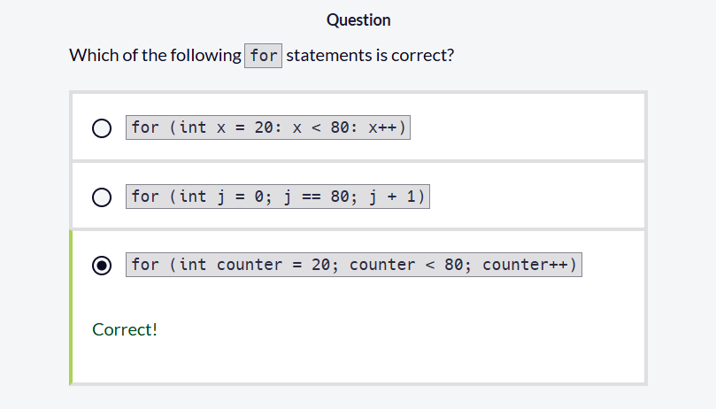

# Summary

**`2 minutes`**

our goal was to gain additional control over the iteration process by implementing the `for` statement in your code.

Modifying the ***initializer, condition***, and ***iterator*** of a `for` statement provides precise control over the iteration logic.

Using the `for` statement, you iterated a hard-coded number of times, and used the `Length` on an array to iterate through the code block once for each item in the array. You modified the iterator, the condition for exiting the loop, and the pattern for iteration. You used the `break` keyword to exit out of the loop's body prematurely.

Without the iteration control provided by the `for` statement, you wouldn't be able to complete certain coding tasks, such as looping through the data in a multidimensional array.

### freeCodeCamp Question

