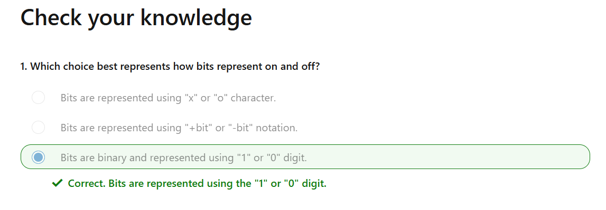

# Discover Value types and reference types

**`8 minutes`**

With many data types available in C#, choosing the right one to use means that you need to understand when you might choose one data type over another.

Before discussing why you might choose one data type over another, you need to understand more about data types. You also need to know how data and data types work in C# and .NET.

### What is data?

Answering the question "what is data" depends on who you ask, and in what context you're asking it.

In software development, data is essentially a value that is stored in the computer's memory as a series of bits. A bit is a simple binary switch represented as a 0 or 1, or rather, "off" and "on." A single **bit** doesn't seem useful, however when you combine 8 bits together in a sequence, they form a **byte**. When used in a byte, each bit takes on a meaning in the sequence. In fact, you can represent 256 different combinations with just 8 bits if you use a binary (base-2) numeral system.

For example, in a binary numeral system, you can represent the number `195` as `11000011`. The following table helps you visualize how this works. The first row has eight columns that correspond to a position in a byte. Each position represents a different numeric value. The second row can store the value of an individual bit, either `0` or `1`.

If you add up the number from each column in the first row that corresponds to a 1 in the second row, you get the decimal equivalent to the binary numeral system representation. In this case, it would be `128 + 64 + 2 + 1 = 195`.

To work with larger values beyond `255`, your computer stores more bytes (commonly 32-bit or 64-bit). If you're working with millions of large numbers in a scientific setting, you may need to consider more carefully which data types you're using. Your code could require more memory to run.

### What about textual data?

If a computer only understands `0`s and `1`s, then how does it allow you to work with text? Using a system like ASCII (American Standard Code for Information Interchange), you can use a single byte to represent upper and lowercase letters, numbers, tab, backspace, newline and many mathematical symbols.

For example, if you wanted to store a lower-case letter a as a value in my application, the computer would only understand the binary form of that value. To better understand how a lower-case letter a is handled by the computer, I need to locate an ASCII table that provides ASCII values and their decimal equivalents. You can search for the terms "ASCII lookup decimal" to locate such a resource online.

In this case, the lower-case letter `a` is equivalent to the decimal value `97`. Then, you would use the same binary numeral system in reverse to find how an ASCII letter `a` is stored by the computer.

Since `64 + 32 + 1 = 97`, the 8-bit binary ASCII code for `a` is `01100001`.

It's likely that you'll never need to perform these types of conversions on your own, but understanding the computer's perspective of data is a foundational concept, especially as you're considering data types.

### What is a data type?

A data type is a way a programming language defines how much memory to save for a value. There are many data types in the C# language to be used for many different applications and sizes of data.

For most of the applications you build in your career, you'll settle on a small subset of all the available data types. However, it's still vital to know others exist and why.

### Value vs. reference types

This module focuses on the two kinds of types in C#: reference types and value types.

Variables of reference types store references to their data (objects), that is they point to data values stored somewhere else. In comparison, variables of value types directly contain their data. As you learn more about C#, new details emerge related to the fundamental difference between value and reference types.

### Simple value types

Simple value types are a set of predefined types provided by C# as keywords. These keywords are aliases (a nickname) for predefined types defined in the .NET Class Library. For example, the C# keyword `int` is an alias of a value type defined in the .NET Class Library as `System.Int32`.

Simple value types include many of the data types that you may have used already like `char` and `bool`. There are also many **integral** and **floating-point** value types to represent a wide range of whole and fractional numbers.

### Recap

- Values are stored as bits, which are simple on / off switches. Combining enough of these switches allows you to store just about any possible value.

- There are two basic categories of data types: value and reference types. The difference is in how and where the values are stored by the computer as your program executes.

- Simple value types use a keyword alias to represent formal names of types in the .NET Library.

### Check your knowledge

