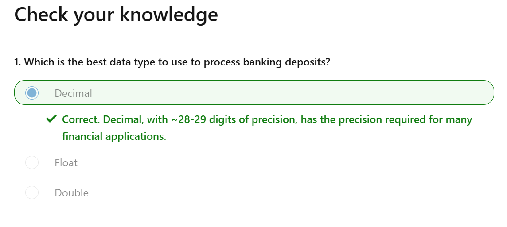

# Exercise - Discover floating-point types

**`8 minutes`**

In this exercise, you work with floating-point data types to learn about the nuanced differences between each data type.

A floating point is a simple value type that represents numbers to the right of the decimal place. Unlike integral numbers, there are other considerations beyond the maximum and minimum values you can store in a given floating-point type.

### Evaluate floating-point types

First, you must consider the digits of precision each type allows. Precision is the number of value places stored after the decimal point.

Second, you must consider the manner in which the values are stored and the impact on the accuracy of the value. For example, `float` and `double` values are stored internally in a binary (base 2) format, while decimal is stored in a `decimal` (base 10) format. Why does this matter?

Performing math on binary floating-point values can produce results that may surprise you if you're used to decimal (base 10) math. Often, binary floating-point math is an approximation of the real value. Therefore, `float` and `double` are useful because large numbers can be stored using a small memory footprint. However, `float` and `double` should only be used when an approximation is useful. For example, being a few thousandths off when calculating the splatter of a snowball in a video game is close enough.

When you need a more precise answer, you should use `decimal`. Each value of type `decimal` has a relatively large memory footprint, however performing math operations gives you a more precise result. So, you should use `decimal` when working with financial data or any scenario where you need an accurate result from a calculation.


### Use the MinValue and MaxValue properties for each signed float type

1. Delete or use the line comment operator `//` to comment out all of the code from the previous exercises.

2. To see the value ranges for the various data types, update your code in the Visual Studio Code Editor as follows:

    ```
    Console.WriteLine("");
    Console.WriteLine("Floating point types:");
    Console.WriteLine($"float  : {float.MinValue} to {float.MaxValue} (with ~6-9 digits of precision)");
    Console.WriteLine($"double : {double.MinValue} to {double.MaxValue} (with ~15-17 digits of precision)");
    Console.WriteLine($"decimal: {decimal.MinValue} to {decimal.MaxValue} (with 28-29 digits of precision)");
    ```


3. On the Visual Studio Code **File** menu, select **Save**.

    The `Program.cs` file must be saved before building or running the code.

4. In the EXPLORER panel, to open a Terminal at your TestProject folder location, right-click **TestProject**, and then select **Open in Integrated Terminal**.

    A Terminal panel should open, and should include a command prompt showing that the Terminal is open to your TestProject folder location.

5. At the Terminal command prompt, to run your code, type **dotnet run** and then press Enter.

    If you see a message saying "Couldn't find a project to run," ensure that the Terminal command prompt displays the expected TestProject folder location. For example:

    `C:\Users\someuser\Desktop\csharpprojects\TestProject>`

    #### You should see the following output:
    
    ```
    Floating point types:
    float  : -3.402823E+38 to 3.402823E+38 (with ~6-9 digits of precision)
    double : -1.79769313486232E+308 to 1.79769313486232E+308 (with ~15-17 digits of precision)
    decimal: -79228162514264337593543950335 to 79228162514264337593543950335 (with 28-29 digits of precision)
    ```

As you can see, `float` and `double` use a different notation than is used by `decimal` to represent its largest and smallest possible values. But what does this notation mean?

### Deciphering large floating-point values

Because **floating-point** types can hold large numbers with precision, their values can be represented using "E notation", which is a form of scientific notation that means "times 10 raised to the power of." So, a value like `5E+2` would be the value 500 because it's the equivalent of `5 * 10^2, or 5 x 102`.

### Recap


- A floating-point type is a simple value data type that can hold fractional numbers.

- Choosing the right floating-point type for your application requires you to consider more than just the maximum and minimum values that it can hold. You must also consider how many values can be preserved after the decimal, how the numbers are stored, and how their internal storage affects the outcome of math operations.

- Floating-point values can sometimes be represented using "E notation" when the numbers grow especially large.

- There's a fundamental difference in how the compiler and runtime handle `decimal` as opposed to `float` or `double`, especially when determining how much accuracy is necessary from math operations.


### Check your knowledge

