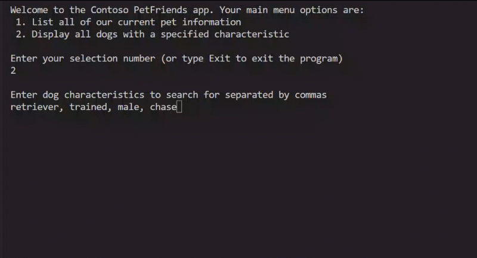

# Exercise - Add improved search animation

`12 minutes`

The Contoso Pets app helps find new homes for abandoned pets. Part of the request for search feature improvement is to update the animated simulation indicating search progress.

### Search animation specification

In this second challenge exercise, you need to update the search animation to resemble spinning and add a count down (2, 1, 0).

### Change the current "searching" animation icons

- Update the current animation "icons" `string[] searchingIcons = {". ", ".. ", "..."};`

- Use new icons that simulate spinning

- Review the animated gif that follows for an example

- You can design the "searching" animation to display "spinning" to work differently than displayed in the animated image

- The "searching..." animation, should continue to be overwritten, after each animation completes so it stays on the same line, and so that it doesn't display after the animation stops.


    

### Add a countdown to the "searching" animation


- Review the previous animated image - note the countdown in the output
- 
    - "`searching...retriever / 2`"

    - The previous number "`2`" displays as "`1`", and finally as "`0`", counting down

- Update the loop that contains the "searching" animation so that the loop can display a countdown

### Code comments


- Numbered code comments in the starter code offer suggestions

- The comments are in a sequential order and only the comments starting with #4, and #5 apply to this exercise of the challenge


### How to check your work

To validate that your code satisfies the specified requirements, complete the instruction steps:

1. Use Visual Studio Code to build and run your app.


## ❗ Note

You can exit the verification test before completing all of the verification steps if see a result that does not satisfy the specification requirements. To force an exit from the running program, in the Terminal panel, press Ctrl-C. After exiting the running app, complete the edits that you believe will address the issue you are working on, save your updates to the Program.cs file, and then re-build and run your code.

#

2. The terminal command prompt should display as the starting point for the program

3. At the command prompt, enter **2** menu:

    ```
    Welcome to the Contoso PetFriends app. Your main menu options are:
    1. List all of our current pet information
    2. Display all dogs with a specified characteristic

    Enter your selection number (or type Exit to exit the program)
    2

    Enter dog characteristics to search for separated by commas
    ```

4. At the command prompt, enter **golden, big** and press enter to test the search status messages with animation and countdown

5. Verify that the console panel updates with temporary "searching" status messages ***similar*** to the **code output** **samples**:

    ```
    Enter dog characteristics to search for separated by commas
    golden, big

    searching our dog Nickname: lola for big / 2
    ```

    ```
    searching our dog Nickname: lola for big -- 1
    ```

    ```
    searching our dog Nickname: lola for golden \ 1
    ```

    ```
    searching our dog Nickname: lola for golden * 0
    ```

6. All the user entered search terms should display with the "`searching`" spin animation and countdown for each dog where the "searching our dog..." line in the output overwrites the previous line to create an animation

7. Refer to the previous animated image of the running program for more examples of the "searching" status animation with countdown

8. Validate after the searching has stopped, the "`searching`" animation and countdown no longer displays

## ❗ Note

If your code meets the requirements you should be able to complete each step in order and see the expected results in a single test pass.

Congratulations if you succeeded in this exercise challenge!