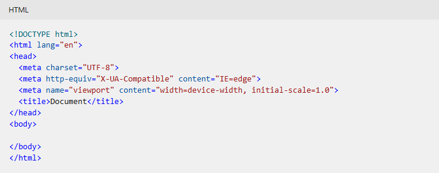
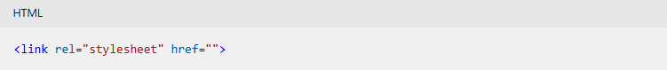
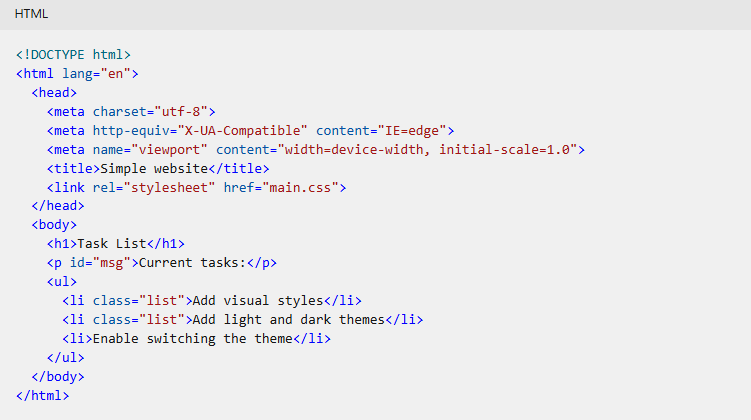
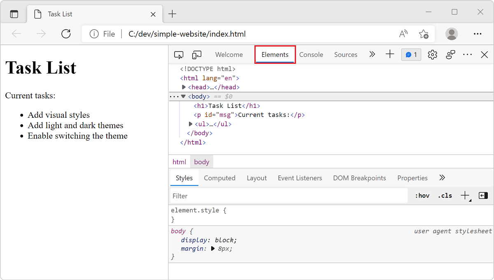

# Exercise - Add basic HTML to your web app

**`10 minutes`**

At the moment, your website has an empty HTML file. Let's add some code! The goal is to use hypertext markup language (HTML) to describe the web page your customers' browsers should display. Wouldn't it be nice to have a starting template? Editors can conveniently fill in some of the typical boilerplate or HTML structure for you.

In this unit, you add basic HTML content, open the HTML page in a browser, and get your first look at the developer tools.

### Add some HTML code

Visual Studio Code provides basic support for HTML programming out of the box. There's syntax highlighting, smart completions with IntelliSense, and customizable formatting.

1. Open your website folder in Visual Studio Code, then open the index.html file by selecting it in the **Explorer**.

2. In the `index.html` page, type `html:5`, and then select `Enter`. HTML5 template code is added to the file.

### ❗Note

If the HTML5 template code isn't added to the `index.html` file, try closing and reopening the file.

3. Edit the template code so that it resembles the following. Then save the file by selecting `Control+S` on Windows or `Command+S` on macOS.

     ```
     <!DOCTYPE html>
     <html lang="en">
     <head>
     <meta charset="UTF-8">
     <meta http-equiv="X-UA-Compatible" content="IE=edge">
     <meta name="viewport" content="width=device-width, initial-scale=1.0">
     <title>Document</title>
     </head>
     <body>

     </body>
     </html>
     ```
     

There have been different versions of HTML. The *doctype* `<!DOCTYPE html>` indicates this HTML document contains HTML5 code.

While we aren't going to delve deeply into the meaning of all the HTML elements, we want to point out a few important items. The `meta` tag indicates *metadata* information that isn't typically visible to the viewer unless they view the source code in their browser. Meta elements or tags provide descriptive information about the webpage. For example, they help search engines process which information in your webpages to return in search results.

The ***character set*** (`charset`) for UTF-8 might seem insignificant, but it's crucial for establishing how computers interpret characters. If the metadata for the character set is missing, that can lead to compromised security. There's quite a bit of history and technical information behind the charset attribute, but the important takeaway from this exercise is that the Visual Studio Code boilerplate provides some sensible defaults.

### Edit the head

The `<head>` element in your HTML code contains information about your website not visible inside the browser tab.

The *metadata* defines data about the HTML document, such as character set, scripts, and which browser the webpage opens in.

The *title* of a webpage appears at the top of a browser window, and is significant in many ways. For example, the title is used by and displayed in search engines. Let's add a title.

### ❗Important

From this point forward, the ellipsis (...) indicates that previously declared code precedes or follows. There should be enough code provided as context to make necessary changes or update your work, but you should not copy and paste the ellipsis into your code.

1. In the editor, modify the`<title>` element so that it resembles the following example.

     ```
     ...
     <head>
     <meta charset="utf-8">
     <meta http-equiv="X-UA-Compatible" content="IE=edge">
     <meta name="viewport" content="width=device-width, initial-scale=1.0">
     <title>Simple website</title>
     ...
     ```

To apply styles to the HTML elements on the webpage, you could write the CSS code directly in the webpage head. Writing CSS in the HTML page is called ***internal*** CSS. However, it's a best practice to separate HTML structure and CSS styling. Having a separate CSS page is called ***external*** CSS. Code tends to be easier to read when it's concise and compartmentalized. You can use one or more external style sheets to service multiple webpages. Rather than updating each HTML page with replicated CSS code, you can make changes to a single CSS file and have those updates applied to all of the dependent web pages. Let's link to an external CSS file.

1. In the Visual Studio Code editor, add a blank line after the `<title>` element, type `link`, and then select `Enter`. Visual Studio Code should add the following line to your `index.html` file.

```
<link rel="stylesheet" href="">
```


2. Update the `href=` to `href="main.css"`, and save the file by selecting `Control+S` on Windows or `Command+S` on macOS.

```
...
<head>
  <meta charset="utf-8">
  <meta http-equiv="X-UA-Compatible" content="IE=edge">
  <meta name="viewport" content="width=device-width, initial-scale=1.0">
  <title>Simple website</title>
  <link rel="stylesheet" href="main.css">
</head>
...
```


### Edit the body

Let's start filling in the <body> element now.

The `<body>` element contains your website's content that's visible to your customers in their browsers.

1. Inside the `<body>` element, add a *heading* `<h1>` element, followed by a *paragraph* `<p>` element, and then create an *unordered list* `<ul>` that contains several *list item* `<li>` elements.

2. Edit your code, or copy and paste, so that it looks like the following example.

```
<!DOCTYPE html>
<html lang="en">
  <head>
    <meta charset="utf-8">
    <meta http-equiv="X-UA-Compatible" content="IE=edge">
    <meta name="viewport" content="width=device-width, initial-scale=1.0">
    <title>Simple website</title>
    <link rel="stylesheet" href="main.css">
  </head>
  <body>
    <h1>Task List</h1>
    <p id="msg">Current tasks:</p>
    <ul>
      <li class="list">Add visual styles</li>
      <li class="list">Add light and dark themes</li>
      <li>Enable switching the theme</li>
    </ul>
  </body>
</html>
```


You can use an ID attribute (used in the `<p>` element) for styling one element, while the class attribute (used in the `<li>` element) is for styling all elements of the same class.

Before the next step, make sure your file is saved by selecting `Control+S` or `Command+S`.

### Open in browser

You can preview your webpage locally by opening the HTML file in a browser. Instead of a website address that begins with `https://`, your browser points to the local file path, which should look similar to `C:/dev/simple-website/index.html`.

- To preview using Visual Studio Code, right-click `index.html` and select **Open In Default Browser**, or select the `index.html` file and use the keyboard shortcut `Alt+B`.

     

### ❗Important

If you're having trouble, make sure you're directly right-clicking the filename icon or text. If a Visual Studio Code dialog appears, select **Yes, I trust the authors**; this is the Workspace Trust feature that lets you decide whether your project folders should allow or restrict automatic code execution. You just created the file, so it's safe.

The webpage opens in your default browser.

### View the page using developer tools

You can inspect a webpage by using the developer tools in your browser. Let's give it a try.

1. Open Developer Tools by right-clicking in the web page and selecting **Inspect**, or try these shortcuts:

- Press the keyboard shortcut for **Developer Tools**, which is `F12`.

- Press `Ctrl+Shift+I` on Windows and Linux or `Option+Command+I` on a Mac.


     These keyboard shortcuts work in **Microsoft Edge**, **Chrome**, and **Firefox**. If you're using **Safari**, see the  [**`Web Development Tools`**](https://developer.apple.com/safari/tools/). When installed, select **Safari > Preferences**, then select **Advanced**. At the bottom of the pane, select the **Show Develop menu in menu bar** checkbox. Select **Develop > Show Web Inspector**. For more information, check the Safari Web Inspector documentation.

     To learn more about opening Developer Tools and the main available features, check out the Overview of [**`DevTools article`**](https://learn.microsoft.com/en-us/microsoft-edge/devtools-guide-chromium/overview).

2. Select the **Elements** tab.

     

3. Move your mouse over the HTML elements displayed in the **Elements** tab, and expand the contents of the various elements.

The **Elements** tab in developer tools shows you the document object model (DOM) as rendered in the browser. When debugging, it's often important to see how the browser interprets your source code.

Inspecting the page in a browser provides all sorts of useful information and can help you troubleshoot problems. You can also view CSS details with the inspector, as you'll see in the next section.