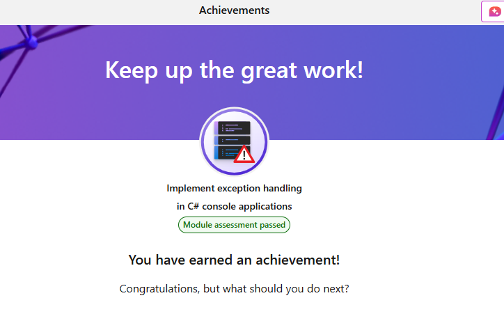

# Summary

`1 minute`

Your goal was to gain experience implementing exception handling in C# applications using Visual Studio Code.

By examining the properties of common exception types and experimenting with the `try-catch` pattern, you gained experience catching runtime exceptions. You used exception handling to catch exceptions in the method where they occurred and at a lower level of the call stack. You also practiced using two or more `catch` clauses to catch different exception types associated with a single `try` code block.

Without the ability to implement exception handling, you wouldn't be able to delivery stable and reliable C# applications.

